<div align="center">





[](https://react.dev/)
[](https://www.typescriptlang.org/)
[](https://ai.google.dev/)
[](https://supabase.com/)

[](LICENSE)
[](CONTRIBUTING.md)

**[Report Bug](https://github.com/JDRV-space/donde-esta-mi-plata/issues/new?template=bug_report.md)** · **[Request Feature](https://github.com/JDRV-space/donde-esta-mi-plata/issues/new?template=feature_request.md)**

</div>

## Overview

**Donde Esta Mi Plata?** turns your phone into a budget-aware civic reporting tool. Point your camera at a pothole, broken streetlight, or overflowing trash and **Gemini AI** instantly analyzes the photo, categorizes the problem across 7 infrastructure types, estimates repair costs in Soles, and scores severity 1-5.

The AI cross-references your complaint against **actual budget execution data** for your district, showing exactly how much was allocated vs. spent. This gives you the evidence to hold your municipality accountable under Transparency Law 27806.

Budget data sourced from Peru's **Ministry of Economy and Finance (MEF)**. Structured JSON output. Multimodal AI that turns citizen photos into actionable government intelligence.

**Built for Lima's 43 districts. Starting with Lima, your city next.**

## Features

| Feature | Description |
|---------|-------------|
| **AI Photo Analysis** | Gemini 2.5 Flash analyzes infrastructure photos, categorizes issues, estimates repair costs in Soles |
| **7 Infrastructure Categories** | Road damage, lighting, trash, water, parks, buildings, other |
| **Severity Scoring** | 1-5 severity scale with AI-generated justification |
| **Budget Cross-Reference** | Matches complaints against real municipal budget execution data |
| **Interactive Map** | District-level budget visualization across all 43 Lima districts |
| **Economic Indicators** | Real-time exchange rate and inflation data from BCRP (Peru Central Bank) |
| **Multi-Language** | Spanish, English, and Quechua support for 700K+ indigenous citizens in Lima |
| **Zero Backend** | 100% client-side processing, your photos never leave your browser |


## Tech Stack

| Layer | Technology |
|-------|------------|
| **Framework** | [React 19](https://react.dev/) |
| **Language** | [TypeScript 5](https://www.typescriptlang.org/) |
| **Build Tool** | [Vite 5](https://vitejs.dev/) |
| **AI Engine** | [Google Gemini 2.5 Flash](https://ai.google.dev/) via `@google/genai` |
| **Database** | [Supabase](https://supabase.com/) (PostgreSQL) |
| **Maps** | [React Leaflet](https://react-leaflet.js.org/) + [Leaflet](https://leafletjs.com/) |
| **Styling** | [Tailwind CSS 3](https://tailwindcss.com/) |
| **Screenshots** | [html2canvas](https://html2canvas.hertzen.com/) |
| **Data Source** | [MEF Peru](https://www.mef.gob.pe/) (Ministry of Economy and Finance) |
| **Typography** | [Merriweather](https://fonts.google.com/specimen/Merriweather) + [Courier Prime](https://fonts.google.com/specimen/Courier+Prime) |


## Quick Start

### Prerequisites

- [Node.js](https://nodejs.org/) (v18+)
- [Google Gemini API Key](https://aistudio.google.com/apikey)
- [Supabase Project](https://supabase.com/) (for budget data)

### Installation

```bash
# Clone the repository
git clone https://github.com/JDRV-space/donde-esta-mi-plata.git
cd donde-esta-mi-plata

# Install dependencies
npm install

# Configure environment variables
cp .env.example .env.local
# Edit .env.local with your API keys

# Start the development server
npm run dev
```

The app will be available at `http://localhost:3000`.

### Production Build

```bash
npm run build
```

Output will be in the `dist/` directory.


## Environment Variables

Copy `.env.example` to `.env.local` and fill in your values:

| Variable | Description | Required |
|----------|-------------|----------|
| `GEMINI_API_KEY` | Google Gemini API key | Yes |
| `SUPABASE_URL` | Supabase project URL | Yes |
| `SUPABASE_ANON_KEY` | Supabase anonymous key | Yes |


## Project Structure

```
donde-esta-mi-plata/
├── components/
│   ├── ReportFlow.tsx             # Report submission workflow with Gemini AI
│   ├── ReportView.tsx             # Main report interface
│   ├── ReportDetailView.tsx       # Report detail modal
│   ├── AllReportsView.tsx         # Reports database view
│   ├── MapView.tsx                # Interactive district map
│   ├── DistrictSummaryCard.tsx    # District budget card
│   └── Onboarding.tsx            # 3-step onboarding flow
├── services/
│   ├── geminiService.ts           # Google Gemini AI integration
│   ├── supabase.ts                # Supabase database client
│   └── bcrpService.ts            # Peru Central Bank API client
├── utils/
│   └── dataProcessing.ts          # District aggregation utilities
├── App.tsx                        # Main application component
├── index.tsx                      # React entry point
├── index.html                     # HTML template
├── LanguageContext.tsx             # i18n context (es/en/qu)
├── types.ts                       # TypeScript type definitions
├── constants.ts                   # Budget data and mock reports
├── translations.ts                # Multi-language strings
├── vite.config.ts                 # Vite configuration
├── tsconfig.json                  # TypeScript configuration
├── package.json                   # Dependencies
└── LICENSE                        # MIT License
```


## How It Works

```
1. Citizen photographs infrastructure problem
           |
2. Gemini AI analyzes photo (client-side)
           |
3. AI categorizes: type, severity (1-5), estimated cost (S/.)
           |
4. System cross-references district budget execution data (MEF)
           |
5. Citizen generates formal complaint with budget evidence
           |
6. Send to municipality via email with tracking code
```


## Legal Framework

- **Ley 27806:** Ley de Transparencia y Acceso a la Informacion Publica
- **Ley 27444:** Ley del Procedimiento Administrativo General
- **Ley 27785:** Ley Organica del Sistema Nacional de Control y de la Contraloria General de la Republica


## Security

- **Client-Side Processing:** Photos analyzed locally via Gemini API, never stored on a server
- **Environment Variables:** All API keys stored in `.env.local`, never committed to git
- **XSS Prevention:** React's built-in output escaping
- **Parameterized Queries:** Supabase SDK prevents SQL injection
- **No PII Storage:** No personally identifiable information persisted


## Contributing

Contributions are welcome. Please read the [Contributing Guide](CONTRIBUTING.md) before submitting a PR.

1. Fork the repository
2. Create your feature branch (`git checkout -b feature/your-feature`)
3. Commit your changes (`git commit -m 'Add your feature'`)
4. Push to the branch (`git push origin feature/your-feature`)
5. Open a Pull Request


## License

This project is licensed under the **MIT License**. See the [LICENSE](LICENSE) file for details.


## Authors

**Juan Diego Rodriguez** [@JDRV-space](https://github.com/JDRV-space)

**mmhc** [@mmhc14](https://github.com/mmhc14)


## Roadmap

Planned features for future releases:

- [ ] **Smart Routing:** Automatically route complaints to municipality if funds exist, or to Contraloria General if budget is depleted
- [ ] **Auto-Escalation Pipeline:** Municipality -> Comptroller -> Press with 10-day deadlines per stage
- [ ] **Supabase Report Persistence:** Store citizen reports in a writable backend table
- [ ] **PostCSS + Tailwind Build:** Replace CDN Tailwind with a proper build step for production
- [ ] **Deployed Live Demo:** Host the app at a public URL

<div align="center">

*Donde esta mi plata? Demand accountability, one photo at a time.*

</div>
